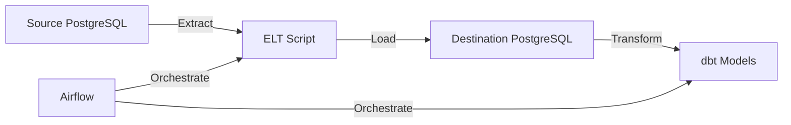

# 🚀 Modern ELT Pipeline with Airflow and dbt

A production-grade ELT (Extract, Load, Transform) pipeline demonstrating modern data engineering practices. This project showcases a complete data pipeline using industry-standard tools and best practices.

## 🎯 Key Features

- **Modern ELT Architecture**: Implements the ELT pattern for better scalability and flexibility
- **Containerized Environment**: Fully containerized using Docker for consistent development and deployment
- **Automated Workflows**: Apache Airflow for robust workflow orchestration
- **Data Transformation**: dbt for version-controlled, tested data transformations
- **Security Best Practices**: Environment variables, secure configurations, and proper access controls
- **Monitoring & Logging**: Comprehensive logging and monitoring throughout the pipeline
- **Data Quality**: Built-in data quality tests and validations

## 🛠 Technology Stack

- **Python 3.8+**: Core programming language
- **PostgreSQL 15**: Source and destination databases
- **Apache Airflow 2.7.1**: Workflow orchestration
- **dbt 1.4.7**: Data transformation
- **Docker & Docker Compose**: Containerization
- **Git**: Version control

## 📊 Architecture



## 🚀 Getting Started

1. **Clone the Repository**
   ```bash
   git clone https://github.com/noshikchowdary/etl_pipeline_airflow.git
   cd etl_pipeline_airflow
   ```

2. **Set Environment Variables**
   ```bash
   export SOURCE_DB_NAME=source_db
   export SOURCE_DB_USER=postgres
   export SOURCE_DB_PASSWORD=your_password
   export SOURCE_DB_HOST=source_postgres
   
   export DESTINATION_DB_NAME=destination_db
   export DESTINATION_DB_USER=postgres
   export DESTINATION_DB_PASSWORD=your_password
   export DESTINATION_DB_HOST=destination_postgres
   ```

3. **Start the Services**
   ```bash
   docker-compose up --build
   ```

4. **Access the Airflow UI**
   - URL: http://localhost:8080
   - Username: airflow
   - Password: airflow

## 📂 Project Structure

```
├── airflow/               # Airflow configuration and DAGs
│   └── dags/             # Airflow DAG definitions
├── custom_postgres/       # dbt project
│   ├── models/           # dbt models
│   ├── tests/            # dbt tests
│   └── macros/           # dbt macros
├── elt/                  # ELT Python scripts
├── source_db_init/       # Source database initialization
├── docker-compose.yaml   # Docker services configuration
├── requirements.txt      # Python dependencies
└── README.md            # Project documentation
```

## 🔒 Security Features

- Environment variables for sensitive data
- Secure database connections
- Proper access controls
- No hardcoded credentials
- Docker security best practices

## 📈 Monitoring and Logging

- Structured logging throughout the pipeline
- Airflow task monitoring
- dbt run logs
- Database operation tracking
- Health checks for all services

## 🧪 Testing

- Unit tests for Python code
- dbt data tests
- Integration tests
- Data quality checks

## 🤝 Contributing

1. Fork the repository
2. Create a feature branch
3. Commit your changes
4. Push to the branch
5. Create a Pull Request

## 📝 License

This project is licensed under the MIT License - see the [LICENSE](LICENSE) file for details.

## 👨‍💻 Author

Noshik Chowdary
- GitHub: [@noshikchowdary](https://github.com/noshikchowdary)
- LinkedIn: [Your LinkedIn Profile]

## 🙏 Acknowledgments

- Apache Airflow community
- dbt Labs
- PostgreSQL community

# 🔄 Data Automation (ELT) Project

Hi, I'm Noshik — I built this end-to-end ELT pipeline to automate data workflows using PostgreSQL, Apache Airflow, dbt, and Docker. It simulates a real-world data engineering setup and is fully containerized for portability.

## 🚀 What This Project Does

### ELT Script  
A custom Python script extracts data from a source PostgreSQL database, transforms it, and loads it into a destination PostgreSQL instance.

### Apache Airflow DAG  
Airflow orchestrates the workflow by running two main tasks:

| Task Name       | Description                                         |
| --------------- | ------------------------------------------------- |
| `run_elt_script` | Executes the ELT script to move and transform data |
| `dbt_run`        | Runs dbt inside a Docker container to model and clean the data |

### dbt (Data Build Tool)  
The dbt project, located in `custom_postgres/`, contains:  
- Models that transform raw data  
- Configurations for sources, targets, and tests  

This turns raw, messy data into clean, analytics-ready tables 📊

### Docker & Docker Compose  
The entire setup is containerized for consistency and ease of deployment, including:  
- **PostgreSQL Containers:** One for source DB, one for destination DB  
- **Airflow Services:** Webserver (UI), scheduler, Postgres metadata DB, and init service  
- **Docker Compose:** `docker-compose.yml` spins up all containers and networks with one command:
```
docker-compose up --build
```
## 🛠 Technologies Used

- Python  
- PostgreSQL  
- Apache Airflow  
- dbt  
- Docker & Docker Compose
---------

## 📂 Folder Structure
```plaintext
├── elt/                       # ELT Python script  
├── custom_postgres/           # dbt project files  
├── dags/                      # Airflow DAGs  
├── docker-compose.yml         # Multi-container setup  
└── README.md                  # Project documentation (this file!)
```

📚 References

Chau, J. (n.d.). The all-in-one workspace for your notes, tasks, wikis, and databases. Notion.
https://transparent-trout-f2f.notion.site/FreeCodeCamp-Data-Engineering-Course-Resources-e9d2b97aed5b4d4a922257d953c4e759

 
